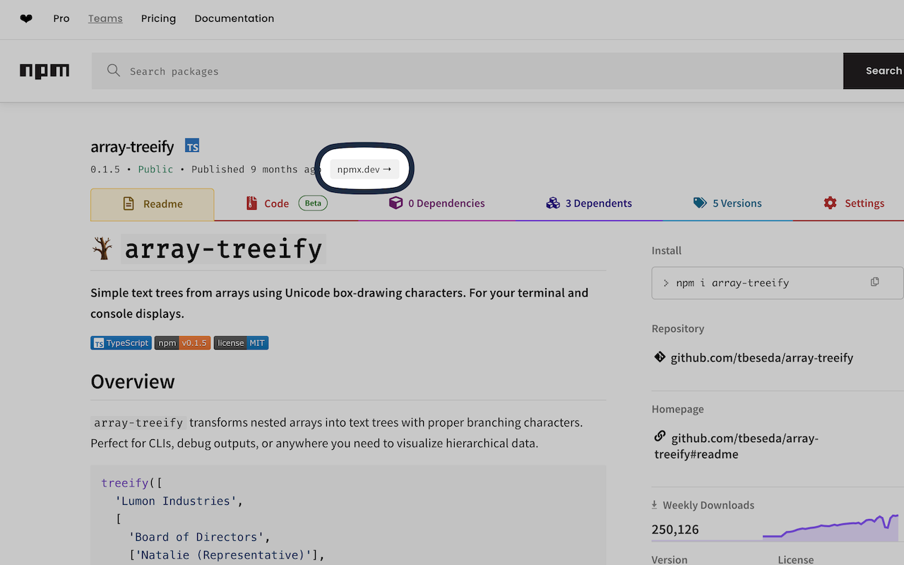

# xnpm

Adds a link to view npm packages on [npmx.dev](https://npmx.dev) directly from npmjs.com package pages.



[Firefox Install](#) <!-- TODO: Add link when published -->

[Chrome Install](#) <!-- TODO: Add link when published -->

[User Script](https://greasyfork.org/en/scripts/564738-xnpm)

## Development

Load the extension unpacked in your browser:
- **Chrome**: `chrome://extensions/` → Enable Developer mode → Load unpacked
- **Firefox**: `about:debugging#/runtime/this-firefox` → Load Temporary Add-on

## Release

```sh
npm run zip
```

Creates `xnpm.zip` with `assets/`, `manifest.json`, and `content.user.js`.

Submit to [Chrome Web Store](https://chrome.google.com/webstore/devconsole/).
Submit to [Firefox Add-ons](https://addons.mozilla.org/en-US/developers/).
User script is automatically submitted via GitHub webhook.
